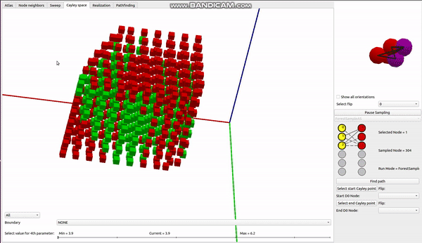
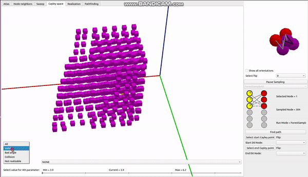
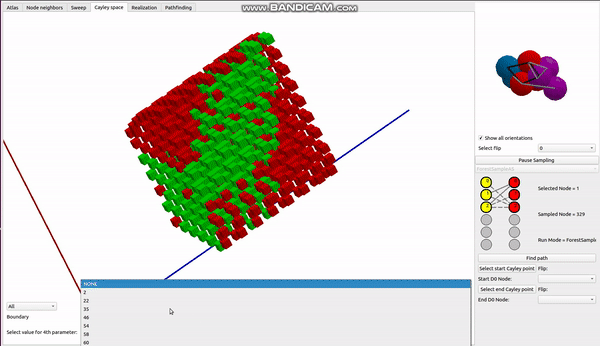
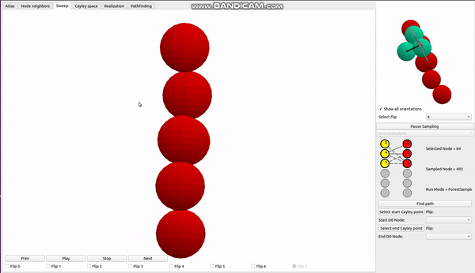
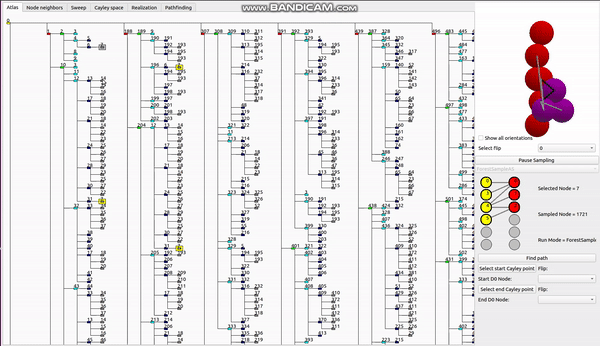

# QtGUIForEASAL
GUI for EASAL software made with Qt and OpenGL

EASAL is molecular modeling software located at https://bitbucket.org/geoplexity/easal.

Code in this repo represents work I did to create new GUI for EASAL with Qt and modern OpenGL. 
This is copy of currently closed repo with new GUI. I moved it here to have it as part of my portfolio.

For this project I wrote small OpenGL render with features you can observe below:

Orthogonal camera

GPU mousepicking

"Transparency"

Instanced rendering (all atoms/spheres are rendered in single call)

Also I did some 2D widgets 

